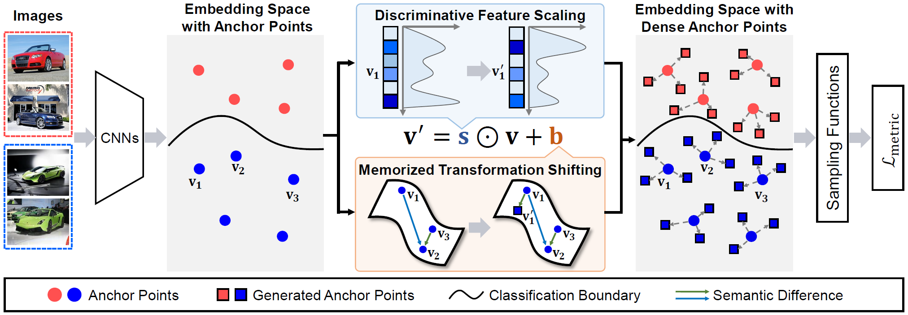
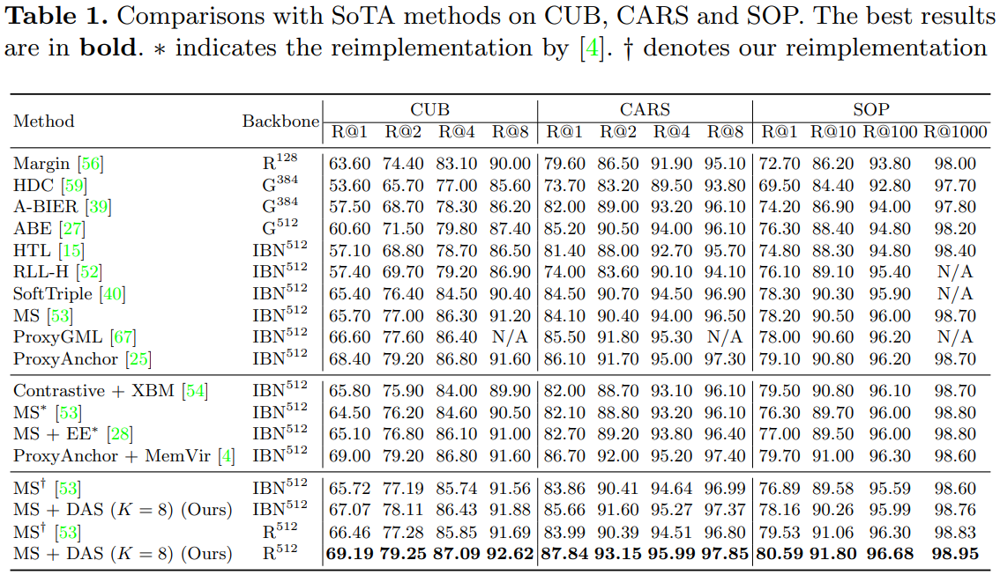
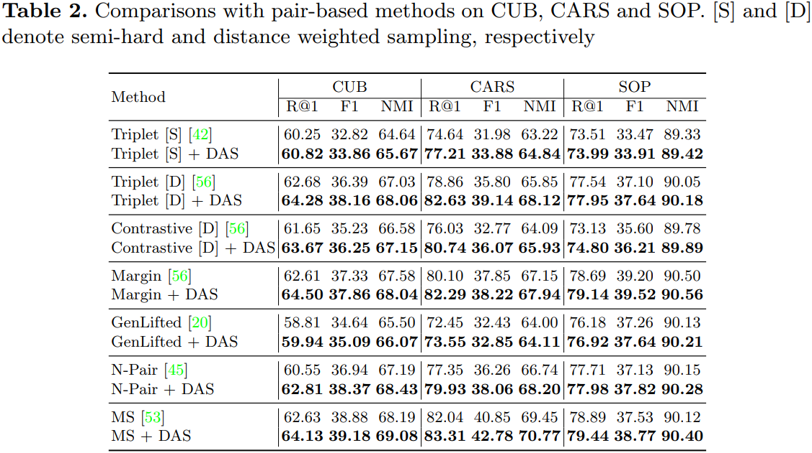
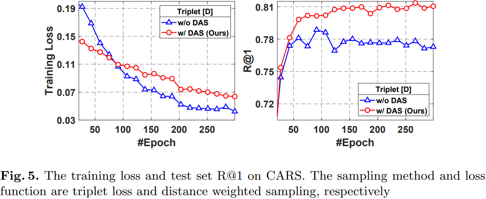
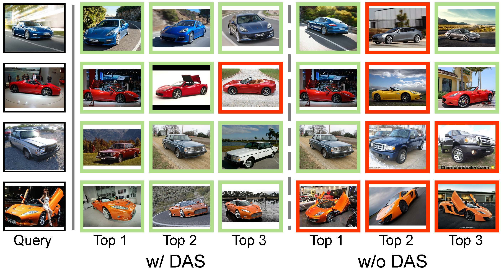
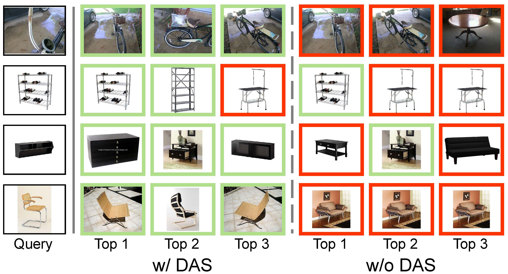
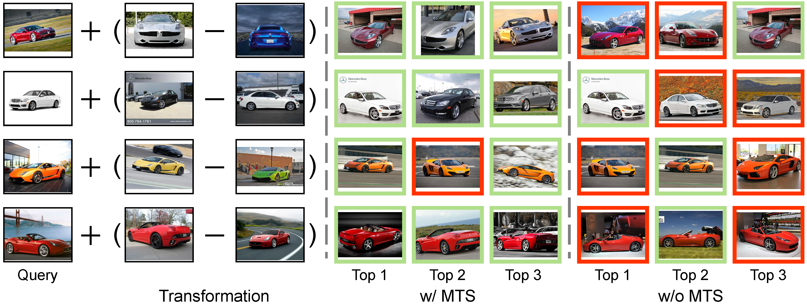

## Densely-Anchored Sampling for Deep Metric Learning (ECCV 2022)
Created by Lizhao Liu, Shangxin Huang from South China University of Technology.

This repository contains the official PyTorch-implementation of our ECCV 2022 paper [*Densely-Anchored Sampling for Deep
Metric Learning*](paper/Densely_Anchored_Sampling_for_Deep_Metric_Learning_ECCV2022.pdf).

In particular, we release the code for reproducing the results of Table (1) and Table (2) in the main paper.

<br>



*Suggestions are always welcome!*

---
## Usage

### Environment
- TITAN XP with CUDA 11.2
- **PyTorch 1.8.1**
- **torchvision 0.9.1**
- **faiss 1.6.1 (GPU version)** for embedding clustering and retrieval
- A full list of dependencies are in [requirements.txt](requirements.txt), you can use
  ```bash
  pip install -r requirements.txt
  ```
  to download all the dependencies.

### Dataset Preparation
We use three datasets: CUB, CARS, SOP in the paper. Download them via links below and unzip them after downloaded.
* CUB200-2011 (1.08 GB): https://www.dropbox.com/s/tjhf7fbxw5f9u0q/cub200.tar?dl=0
* CARS196 (1.86 GB): https://www.dropbox.com/s/zi2o92hzqekbmef/cars196.tar?dl=0
* SOP (2.84 GB): https://www.dropbox.com/s/fu8dgxulf10hns9/online_products.tar?dl=0
* In-Shop (Multiple Files): http://mmlab.ie.cuhk.edu.hk/projects/DeepFashion/InShopRetrieval.html

After unzip, the data fold structure will look like these:

* For CUB/CARS:
```
cub200/cars196
└───images
|    └───001.Black_footed_Albatross
|           │   Black_Footed_Albatross_0001_796111
|           │   ...
|    ...
```

* For SOP:
```
online_products
└───images
|    └───bicycle_final
|           │   111085122871_0.jpg
|    ...
|
└───Info_Files
|    │   bicycle.txt
|    │   ...
```

* For In-Shop

```
in-shop
└─img
|    └─MEN
|         └─Denim
|               └─id_00000080
|                  │   01_1_front.jpg
|                  │   ...
|               ...
|         ...
|    ...
|
└─Eval
|  │   list_eval_partition.txt
```

---

### Reproduce the results in Table (1) and Table (2)

- Change the DATA_ROOT variable in table1.sh and table2.sh to the path that contains the above datasets
- To produce the results in Table (1), simply run the follow command

```
bash table1.sh
```

- To produce the results in Table (2), simply run the follow command

```
bash table2.sh
```

---

## Quantitative Results


---

---

---

## Qualitative Results

- Top 3 retrieved results using the model trained by contrastive loss and distance-weighted sampling method that are
  equipped w/ or w/o on CARS. The expected and unexpected results are framed by green and red rectangles, respectively.



- Top 3 retrieved results using the model trained by margin loss that are equipped w/ or w/o on SOP. The expected and
  unexpected results are framed by green and red rectangles, respectively.



- Top 6 retrieved results with different scales on CARS. The expected and unexpected results are framed by green and red rectangles, respectively


  
- Top 3 retrieved results with MTS on CARS. The expected and unexpected results are framed by green and red rectangles, respectively.



## Acknowledgement
We borrow many codes from [Revisiting_Deep_Metric_Learning_PyTorch](https://github.com/Confusezius/Revisiting_Deep_Metric_Learning_PyTorch). Please show some support!

## Citation
If you find this code helpful for your research, please consider citing
```
@inproceedings{liu2022das,
  title={DAS: Densely-Anchored Sampling for Deep Metric Learning},
  author={Liu, Lizhao and Huang, Shangxin and Zhuang, Zhuangwei and Yang, Ran and Tan, Mingkui and Wang, Yaowei},
  booktitle={European Conference on Computer Vision},
  year={2022},
  organization={Springer}
}
```
